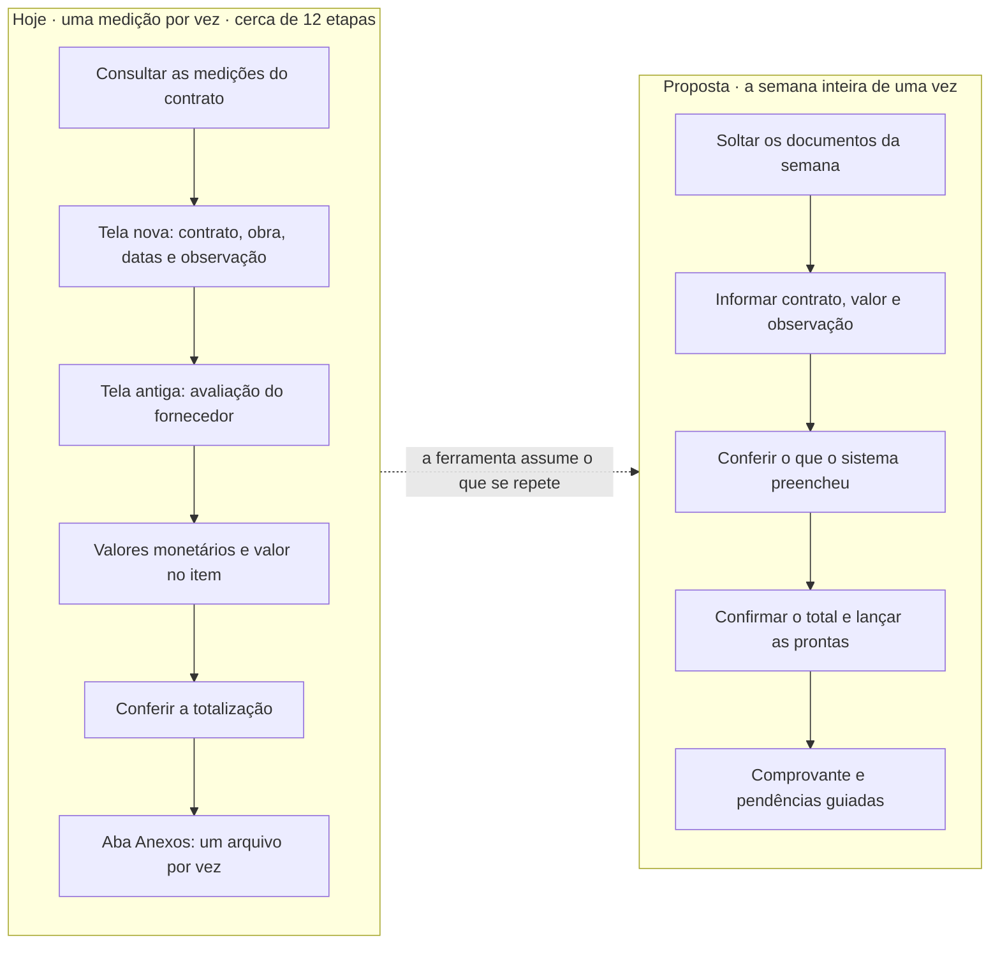
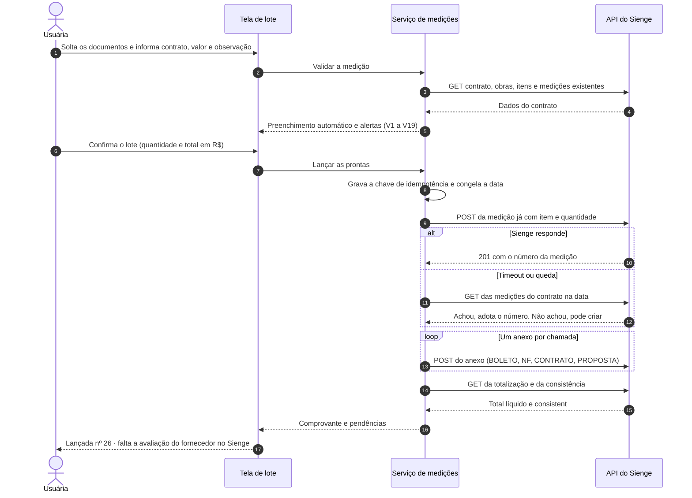
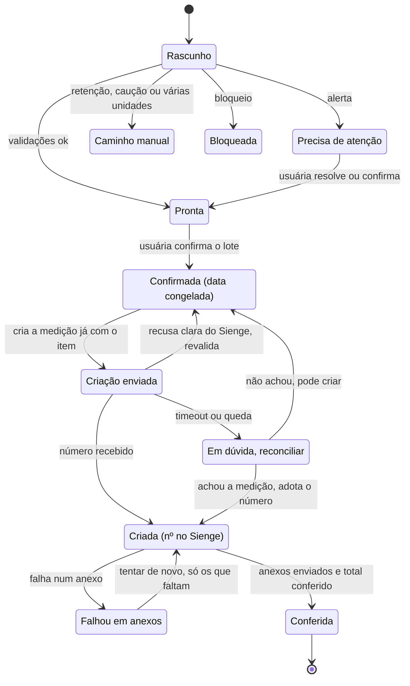

# Planejamento — Automação de Medições de Contratos no Sienge

> Grupo Baptista Leal · Núcleo de Desenvolvimento, Dados e Inovação · Desafio técnico, Etapa 3 · 01/10/2026
>
> Insumo de partida: [`CONTEXTO_automacao_medicoes.md`](CONTEXTO_automacao_medicoes.md) (processo, regras e decisões levantadas nas Etapas 1 e 2).
> Este documento consolida o que foi **verificado**, **decidido** e o que **falta perguntar**. O que já está construído e o que não está fica no [`README`](../README.md).

Marcações usadas:
**[VERIFICADO]** conferido na documentação oficial da API ·
**[DECIDIDO]** escolha tomada e justificada ·
**[ASSUMIDO]** padrão adotado até alguém da área confirmar ·
**[EM ABERTO]** pergunta para a área (seção 10).

---

## Resumo em um minuto

- **Problema.** Cada medição exige cerca de 12 etapas manuais no Sienge, mas só 4 informações mudam de uma para outra: contrato, valor, observação e anexos.
- **Proposta.** Uma tela de lote, onde a usuária solta os documentos da semana e informa só o que muda. Um serviço preenche o resto, valida antes, lança pela **API REST oficial do Sienge**, confere depois e entrega um comprovante. Nada é gravado sem confirmação explícita.
- **O que a leitura da API mudou no desenho:**
  1. Criar a medição e lançar o valor viram **uma única chamada**. A "medição com valor zero" deixa de ser possível.
  2. A API mede em **quantidade, não em reais**. A ferramenta converte e avisa quando a conversão gera diferença de centavos.
  3. **Não existe rota de avaliação de fornecedor** para medições. Esse passo vira um passo guiado, com link para o Sienge.
  4. A API **não aceita o responsável**. A medição fica no nome do usuário de API, e a nossa auditoria registra quem lançou de fato.
  5. A API permite criar a medição **desautorizada**. Assim quem lança continua sendo diferente de quem autoriza.
- **Primeiro passo construído:** o motor de regras e o orquestrador, com testes, rodando contra um cliente simulado (dry-run por padrão), e um protótipo navegável da tela de lote.

---

## 1. Problema e objetivo

O caminho manual passa pela tela nova, pela tela antiga, por uma janela separada de avaliação e pela aba de anexos. As medições se acumulam e são lançadas em sequência. É aí que acontecem os erros caros: medição criada sem valor, medição em dobro, anexo esquecido.

**Objetivo:** a usuária lança **todas as medições da semana de uma vez**, informando só o que muda, e **confia** que foram lançadas certas.



**Princípios [DECIDIDO]:**
- **Simples:** tudo o que o Sienge já sabe, a ferramenta preenche.
- **Intuitivo:** usa a linguagem da usuária, e ela vê o que vai ser lançado antes de lançar.
- **Confiável:** valida antes, confere depois, nunca lança em dobro, retoma de onde parou.
- **Todo imprevisto é mostrado à usuária, e ela decide.** Cada imprevisto novo vira um alerta mapeado.

---

## 2. O que a API oficial do Sienge permite [VERIFICADO]

**Fonte.** Especificações oficiais (Swagger 2.0) lidas em 01/10/2026:

| Spec | O que cobre |
|---|---|
| [`measurement-v1.yaml`](https://api.sienge.com.br/docs/yaml-files/measurement-v1.yaml) | Medições |
| [`contracts-v1.yaml`](https://api.sienge.com.br/docs/yaml-files/contracts-v1.yaml) | Contratos, obras, itens e aditivos |
| [`parameters-v1.yaml`](https://api.sienge.com.br/docs/yaml-files/parameters-v1.yaml) | Parâmetros do sistema |
| [`creditor-v1.yaml`](https://api.sienge.com.br/docs/yaml-files/creditor-v1.yaml) | Fornecedores (credores) |
| [Informações gerais](https://api.sienge.com.br/docs/general-information.html) | URL, autenticação e limites |
| [Webhooks](https://api.sienge.com.br/docs/general-hooks-types.html) | Eventos disponíveis |

> As páginas `html-files/*.html` são um Swagger UI que carrega o YAML por JavaScript. Por isso a leitura automática "não via nada". Os YAML são públicos.

### 2.1 Base

- **URL:** `https://api.sienge.com.br/{subdominio}/public/api/v1/{recurso}`.
- **Autenticação:** Basic, com usuário de API criado no Painel de Integrações. Antes era [ASSUMIDO]; agora está confirmado.
- **Limites:**
  - 200 requisições por minuto por cliente (subdomínio), somando todos os endpoints;
  - cota diária conforme o pacote contratado, de 100 a 200.000 requisições por dia;
  - estourar o limite devolve `429`.
- **Estimativa de consumo:** cerca de 8 a 10 chamadas por medição, ou seja, cerca de 150 num lote de 15 medições. Cabe no limite por minuto, mas o cliente precisa contar as chamadas e respeitar o `429`.
- **Paginação:** `limit` (máximo 200) e `offset`.
- **Erros:** vêm em `ApiError { status, developerMessage, userMessage[], errors[] }`. A `userMessage` pode ser mostrada à usuária, com o nosso contexto em volta.

### 2.2 Mapa "etapa manual → rota"

| # | Etapa manual | Na automação | Rota (base `/public/api/v1`) | Campos que usamos |
|---|---|---|---|---|
| 1 | Login | Usuário de API dedicado | Basic Auth | — |
| 3 | Consulta de medições | Checagem automática (V5, V6, V7, V14) | `GET /supply-contracts/measurements/all?documentId=CT&contractNumber=…` | `measurementDate`, `released`, `finalized`, `netValue`, `totalMaterialValue`, `totalLaborValue` |
| 4 | Escolher contrato | Usuária informa o número **ou** o fornecedor | `GET /supply-contracts?documentId=CT&contractNumber=…` · lista: `GET /supply-contracts/all` | `isAuthorized`, `statusApproval`, `status`, `securityDeposit`, `supplierId`, `supplierName` |
| 5 | Obra e unidade construtiva | Automático (V2, V4, V16) | `GET /supply-contracts/buildings?documentId&contractNumber` | `buildingId`, `buildingName`, `constructUnits[].id/status` |
| 5 | Fornecedor | Vem do contrato; **não vai no POST** | — | — |
| 5 | Responsável | **Não existe no POST.** Fica o usuário de API [EM ABERTO] | — | — |
| 6 | Vencimento | Hoje + 15 dias | `dueDate` no POST | O Sienge exige `dueDate ≥ measurementDate` |
| 7 | Observação | Usuária, com sugestão | `notes` no POST | — |
| 8 | Avaliação do fornecedor | **Sem rota para medições** → passo guiado (seção 3.1) | — | Existe só para pedidos e notas de compra |
| 9 | "Valores monetários" | **Não existe na API.** Os itens são medidos em quantidade | — | Conversão valor → quantidade (V17) |
| 10 | Valor medido no item | Usuária informa o valor; a ferramenta escolhe o item | Itens: `GET /supply-contracts/items?documentId&contractNumber&buildingId&buildingUnitId` · aditivos: `GET /supply-contracts/addenda` e `/addenda/items` | `id`, `wbsCode`, `quantity`, `materialPrice`, `laborPrice`, `hasAddendum` |
| — | **Criar a medição (com o item)** | Uma chamada: cabeçalho + item + quantidade | `POST /supply-contracts/measurements?documentId&contractNumber&buildingId` | Corpo: `measurementDate`, `dueDate`, `notes`, `makeUnauthorized`, `items[{buildingUnitId, itemId, measuredQuantity}]` → `201 {measurementNumber}` |
| — | Acumulado do item (saldo) | Calculado | `GET /supply-contracts/measurements/items?…&measurementNumber` | `cumulativeMeasuredQuantity` + `measuredQuantity` da última medição |
| 11 | Totalização | Conferência automática (V12, V19) | `GET /supply-contracts/measurements?documentId&contractNumber&buildingId&measurementNumber` | `measuredTotal`, `taxValue`, `securityDepositValue`, `netValue`, `consistent`, `authorized` |
| 12 | Anexos | Usuária anexa e escolhe o tipo; o envio é automático | `POST /supply-contracts/measurements/attachments?…&measurementNumber&description=NF` (multipart, campo `file`) | 1 arquivo por chamada, até 70 MB, nome com até 100 caracteres; devolve `201` **sem identificador** |
| 12 | Conferir anexos enviados | Idempotência da retomada | `GET /supply-contracts/measurements/attachments/all?measurementStartDate&measurementEndDate&contractNumber…` | `attachmentNumber`, `name`, `description` |
| — | Parâmetros do Sienge | Ler em vez de supor | `GET /parameters/{id}` (131, 298, 843, 249) | `value`; pode devolver `403` se o parâmetro for interno |
| — | Fase 2: CNPJ → fornecedor | Leitura de documentos | `GET /creditors?cnpj=…` | — |
| — | Fase 2: avisar quando autorizar ou liberar | Fechar o ciclo | Webhooks `MEASUREMENT_AUTHORIZED`, `CLEARING_FINISHED` | `documentId`, `contractNumber`, `buildingId`, `measurementNumber` |

**Fora do escopo:** `PATCH …/measurements/authorize` e `…/disapprove` existem na API, mas autorizar e reprovar são decisões de outras pessoas.

### 2.3 O que a leitura mudou no desenho

1. **Criar a medição já leva o valor.** O POST recebe os itens no corpo. Os passos "criar" e "lançar valor" do contexto viram um só, e o estado intermediário "criada sem valor" deixa de existir. Esse era o aviso "valor da medição igual a zero" que precisávamos evitar.
2. **A API mede em quantidade, com 4 casas decimais.** A ferramenta calcula `quantidade = valor ÷ (preço de material + preço de mão de obra)`.
   - Se o item tem preço unitário 1,00 (cadastrado "em reais"), o valor é exato.
   - Se o item é "1 vb × R$ 3.200,00", então R$ 264,66 vira 0,0827, que corresponde a **R$ 264,64**.
   - A ferramenta mostra o valor que de fato será lançado e pede decisão (V17). **Nunca arredonda calada.**
3. **A avaliação do fornecedor não tem rota.** Ela vira passo guiado.
   - Se o parâmetro 131 tornar a avaliação obrigatória, a medição fica inconsistente até alguém avaliar.
   - A ferramenta lê o campo `consistent` depois de lançar e mostra a pendência (V19) com o link para o Sienge.
4. **O responsável não é aceito no POST.** No Sienge, a medição deve aparecer com o usuário de API. Quem lançou fica registrado na auditoria da ferramenta [EM ABERTO: a área aceita isso?].
5. **`makeUnauthorized`.** Se o usuário de API tiver permissão para autorizar, a medição nasceria autorizada e pularia a aprovação de uma pessoa. O padrão é enviar `true`, preservando a segregação de funções [ASSUMIDO].
6. **Regras que o Sienge recusa com `422` e que antecipamos como validação:**
   - vencimento anterior à data da medição;
   - **medições anteriores não finalizadas** (V14, que não estava no contexto);
   - medição com data posterior (V6 e V7);
   - item acima do contratado (V8).
7. **Anexo enviado não devolve identificador.** Para não duplicar na retomada, a ferramenta lista os anexos da medição e compara nome e descrição antes de reenviar.
8. **Retenção e impostos.**
   - A caução aparece no contrato (`securityDeposit`).
   - Os impostos só aparecem na medição já criada.
   - Por isso a detecção é feita de três formas: caução pelo contrato; provável retenção pelo histórico (medições anteriores com total líquido menor que o bruto); e conferência depois de lançar (V12).

### 2.4 Correções ao documento de contexto

| No contexto | Na documentação oficial |
|---|---|
| `/measurements/clearing` = glosa/compensação | É a **liberação** da medição (títulos gerados) |
| `GET /supply-contracts` = contratos com filtros, inclusive por fornecedor | É a consulta de **um** contrato. A lista é `/supply-contracts/all`, que **não filtra por fornecedor**: a busca por nome roda sobre a lista em cache, e por CNPJ via `/creditors` |
| "Valores monetários" tem equivalente na API [EM ABERTO] | Não tem: a API só aceita quantidade (`measuredQuantity`) |
| Rota de avaliação talvez exista [EM ABERTO] | Não existe para medições |
| Autenticação Basic [ASSUMIDO] | Confirmada |

### 2.5 O que ainda precisa ser conferido na API simulada (ou numa base de homologação)

- Se `measuredQuantity` aceita mais de 4 casas decimais e como arredonda.
- Qual responsável fica gravado na medição criada pela API.
- Se a medição sem avaliação fica com `consistent = false`.
- O tipo de `constructUnit.id`: na spec de contratos é texto; no POST, `buildingUnitId` é inteiro.
- Se `/measurements/items` devolve só os itens medidos naquela medição. Isso afeta o cálculo do acumulado quando o item-alvo não foi medido na última medição. Alternativa: somar `buildingAppropriations[].measuredQuantity` do item.
- O formato do link direto para a medição na tela do Sienge (vai no comprovante).

---

## 3. Arquitetura [DECIDIDO]

```
Tela de lote (navegador, login corporativo)
        │
        ▼
Serviço de medições ─────────────────► API REST do Sienge ──► (o Sienge envia ao ZEPP; já existe)
 ├─ Motor de regras      funções puras: preenche e valida (sem rede)
 ├─ Orquestrador         passos, estados, idempotência, retomada
 ├─ Cliente do Sienge    uma interface com três implementações: HTTP · falsa (testes) · dry-run
 ├─ Estado + auditoria   SQLite no produto (JSON no protótipo)
 └─ Segredos             variáveis de ambiente / cofre, nunca no código
```

- A tela conversa só com o serviço. Só o serviço conversa com o Sienge.
- O cliente do Sienge fica isolado: quando chegar a API simulada, ou o acesso real, muda só a implementação HTTP.
- As regras configuráveis ficam em `config.py`: dias até o vencimento, modelo de observação, critério do item, tipos de anexo e `makeUnauthorized`.

**Onde fica cada parte no código:**

| Módulo | Responsabilidade |
|---|---|
| `medicoes/dinheiro.py` | `Decimal`, formato brasileiro ("3.042,36"), conversão valor ↔ quantidade |
| `medicoes/dominio.py` | Modelos (contrato, obra, item, medição, anexo, alerta), status e etapas |
| `medicoes/regras/preenchimento.py` | Obra, vencimento, observação, item-alvo, saldo (funções puras) |
| `medicoes/regras/validacoes.py` | V1 a V19 (funções puras) |
| `medicoes/sienge/cliente.py` | Interface do cliente, um método por rota verificada |
| `medicoes/sienge/falso.py` | Implementação em memória, com falhas injetáveis por passo |
| `medicoes/orquestrador.py` | Sequência, estados, idempotência, reconciliação, retomada |
| `medicoes/estado.py` | Persistência do estado do lote |
| `medicoes/cli.py` | `medicoes lancar lote.json [--executar]` (dry-run por padrão) |
| `interface/` | Protótipo da tela de lote |

### 3.1 Sequência de um lançamento



| # | Passo | Rota | Tipo | Se falhar |
|---|---|---|---|---|
| 1 | Ler contrato, obras, unidades, itens e acumulado | GETs de contratos e itens | Leitura | Tenta de novo com espera; persistindo, mostra o erro. Nada a desfazer |
| 2 | Ler medições existentes (V5, V6, V7, V14) | `GET …/measurements/all` | Leitura | Idem |
| — | **Usuária confirma.** A data da medição é congelada aqui | — | — | — |
| 3 | Criar a medição com item e quantidade | `POST …/measurements` | Escrita | `422`: mostra a regra violada. Sem resposta: **reconcilia antes de recriar** (3.3) |
| 4 | Enviar os anexos, um por chamada | `POST …/measurements/attachments` | Escrita | Retoma só os que faltam, conferindo a lista |
| 5 | Ler a totalização e a consistência | `GET …/measurements` | Leitura | V12 (total diferente), V19 (falta avaliação) |
| 6 | Passo guiado: avaliação no Sienge | — | Manual | Fica como pendência com link, até `consistent = true` |

### 3.2 Estados



Qualquer passo de escrita pode falhar, e a retomada continua do passo que falhou. Depois de conferida, a medição ainda pode ficar com a pendência da avaliação do fornecedor (V19).

`AVALIADA` e `VALOR_LANCADO`, que estavam no contexto, saíram: o valor entra na criação, e a avaliação não tem rota.

**Status mostrado à usuária:** Falta contrato · Falta valor · Precisa de atenção · Fica para o caminho manual · Pronta · Lançando · Lançada · Falhou em <passo> · Lançada, falta a avaliação.

### 3.3 Idempotência, reconciliação e retomada

- **Chave por medição:** `sha256(contrato + obra + item + quantidade + data congelada + hashes dos anexos)`. É gravada **antes** do POST.
- Se a medição já tem número do Sienge, **nunca** cria outra.
- **Timeout ou queda depois do POST** deixam um estado ambíguo (`CRIACAO_ENVIADA`): a medição pode ter sido criada ou não. Antes de qualquer nova tentativa, a ferramenta consulta `GET …/measurements/all` por contrato, obra e data:
  - 1 medição com o mesmo valor → adota o número;
  - nenhuma → pode criar;
  - mais de uma, ou uma divergente → **imprevisto** (V13), e a usuária decide.
- **Anexos:** antes de reenviar, a ferramenta lista os anexos da medição e envia só os que faltam (comparando nome e descrição).
- **Retentativa com espera** só em leituras, `429` e `5xx`. Escritas **nunca** são repetidas às cegas.
- O botão de lançar trava após o clique, e o serviço tem trava por chave contra execução em paralelo.
- A falha de uma medição não interrompe as outras do lote.

### 3.4 Modelo de dados

| Entidade | Campos |
|---|---|
| `Lote` | `id`, `criado_por`, `criado_em`, `status` |
| `Medicao` | `id_local`, `lote_id`, `chave_idempotencia`, `contrato`, `obra`, `unidade`, `fornecedor`, `item_alvo`, `valor_informado` (Decimal), `quantidade`, `valor_efetivo`, `observacao`, `data_medicao` (congelada), `data_vencimento`, `etapa`, `status`, `numero_medicao_sienge`, `alertas[]`, `pendencias[]`, `erro` |
| `Anexo` | `id`, `medicao_id`, `nome_arquivo`, `tipo` (BOLETO, NF, CONTRATO ou PROPOSTA), `hash`, `enviado` |
| `Evento` (auditoria) | `medicao_id`, `passo`, `resultado`, `mensagem`, `quem`, `quando`. Nunca grava senha, token ou CPF |

### 3.5 Como cada erro da API é tratado

| Resposta | Significado | Ação |
|---|---|---|
| `400` | Requisição mal formada (erro nosso) | Imprevisto + log técnico; não tenta de novo |
| `401` / `403` | Credencial ou recurso não liberado | Para o lote inteiro e avisa o responsável técnico |
| `404` | Contrato ou obra não encontrado | Mensagem para a usuária revisar o contrato |
| `422` | Regra de negócio do Sienge | Mostra a `userMessage` com contexto. Se nenhuma validação nossa previu o caso, ele vira um alerta novo mapeado |
| `429` | Limite de requisições | Leitura: espera e tenta de novo. Escrita: pausa o lote |
| `5xx` / timeout | Instabilidade | Leitura: tenta de novo com espera. Escrita: reconcilia (3.3) |

---

## 4. Regras de preenchimento

| Campo | Origem | Regra | Status |
|---|---|---|---|
| Contrato | Usuária | Busca pelo número (CT/…) ou pelo nome do fornecedor, sobre a lista em cache | DECIDIDO |
| Obra | Ferramenta | 1 obra → preenche e mostra; várias → a usuária escolhe; 0 → bloqueia | DECIDIDO |
| Unidade construtiva | Ferramenta | Exatamente 1 e liberada; caso contrário, fora do MVP ou bloqueio | DECIDIDO |
| Fornecedor | Ferramenta | Vem do contrato | VERIFICADO |
| Responsável | Sienge | Usuário de API (o POST não aceita outro); quem lançou fica na auditoria | VERIFICADO / EM ABERTO |
| Data da medição | Ferramenta | Hoje (America/Recife), **congelada na confirmação** | DECIDIDO |
| Vencimento | Ferramenta | Hoje + 15 dias corridos, sem ajuste para fim de semana ou feriado | DECIDIDO (o ajuste está EM ABERTO) |
| Observação | Usuária | Pré-preenchida "Referente aos serviços prestados pelo {fornecedor} - {Mês}/{AAAA}", editável. Pode vir do parâmetro 843 | DECIDIDO (o texto final está EM ABERTO) |
| Desautorizada (`makeUnauthorized`) | Ferramenta | `true` por padrão | ASSUMIDO |
| Item que recebe o valor | Ferramenta | Em ordem: **(1)** só entram itens cujo saldo comporte o valor inteiro, senão o Sienge recusa; **(2)** entre eles, o mesmo item da última medição do contrato, por continuidade, que é o que ela faz hoje [roadmap]; **(3)** se não houver, o mais recente (com aditivo, depois maior referência); **(4)** se nenhum comportar, não divide sozinho: avisa, e ela decide. A tela mostra por que o item foi escolhido e permite trocar. A regra é validada no dry-run das 20 medições antigas | DECIDIDO (1, 3 e 4 implementados; o desempate e a divisão entre itens estão EM ABERTO) |
| Quantidade | Ferramenta | `valor ÷ preço unitário`, 4 casas; mostra o valor efetivo | VERIFICADO |
| Valor | Usuária | Maior que zero e até o saldo do item | DECIDIDO |
| Saldo do item | Ferramenta | `(quantidade contratada − acumulado medido) × preço unitário` | DECIDIDO |
| Anexos | Usuária | Escolhe o tipo; a descrição no Sienge é o tipo | DECIDIDO |
| Avaliação do fornecedor | Usuária, no Sienge | Passo guiado; pendência até `consistent = true` | VERIFICADO (sem rota) |

**Fixture de referência** (exemplo real do manual):
- Contrato CT/1241, item 002 (com aditivo): contratado 3.200,00 e acumulado 2.911,26, logo **saldo de 288,74**.
- O valor 264,66 é válido.
- O valor 300,00 é bloqueado.

---

## 5. Validações (o coração da confiabilidade)

Cada validação gera uma mensagem **na linguagem da usuária**, com o motivo e o que fazer. O detalhe técnico vai só para o log.

| ID | O que verifica | Quando | Efeito | Mensagem para a usuária (exemplo) |
|---|---|---|---|---|
| V1 | Contrato existe e está autorizado | Ao escolher o contrato | Bloqueia | "O contrato CT/0977 está desautorizado no Sienge. Fale com quem autoriza contratos." |
| V2 | Obras do contrato: 0, 1 ou várias | Ao escolher o contrato | 0 bloqueia · várias pede escolha | "Este contrato tem 2 obras. Escolha em qual lançar." |
| V3 | Caução ou retenção (contrato ou histórico) | Ao escolher o contrato | Fora do MVP | "Este contrato tem caução. Por enquanto ele segue pelo caminho manual." |
| V4 | Mais de uma unidade construtiva | Ao escolher o contrato | Fora do MVP | "Este contrato tem mais de uma unidade construtiva. Segue pelo caminho manual." |
| V5 | Já existe medição do contrato no mês | Antes de confirmar | Atenção, com confirmação explícita | "Já existe a medição nº 25 deste contrato em outubro. Lançar mesmo assim?" |
| V6 | Existem medições posteriores liberadas | Antes de confirmar | Bloqueia | "Há uma medição com data posterior já liberada. O Sienge não aceita uma nova antes dela." |
| V7 | Hoje ≥ data da última medição | Antes de confirmar | Bloqueia | "A última medição é de 05/10, depois de hoje. Confira as datas." |
| V8 | Valor maior que zero e até o saldo do item | Ao digitar | Bloqueia | "Valor acima do saldo do item (R$ 288,74)." |
| V9 | Nenhum item com saldo | Ao escolher o contrato | Atenção | "Nenhum item do contrato tem saldo. Confira o contrato antes de lançar." |
| V10 | Duplicidade no lote (mesmo arquivo ou mesmo contrato) | Ao montar o lote | Atenção | "Este boleto já está em outra medição deste lote." |
| V11 | Medição sem anexo | Antes de confirmar | Atenção | "Esta medição não tem nenhum documento anexado." |
| V12 | Total líquido diferente do valor lançado | Depois de lançar | Atenção, com a diferença | "O Sienge calculou R$ 251,43 líquidos (R$ 13,23 a menos). Provável retenção de imposto." |
| V13 | Qualquer resposta inesperada | A qualquer momento | Imprevisto registrado; a usuária decide | "Algo inesperado aconteceu ao lançar. Nada foi duplicado. Veja o que fazer." |
| V14 | Medições anteriores não finalizadas | Antes de confirmar | Bloqueia | "A medição nº 24 ainda não foi finalizada. O Sienge não aceita a próxima antes disso." |
| V15 | Contrato rescindido, concluído ou totalmente medido | Ao escolher o contrato | Bloqueia | "Este contrato está concluído e não aceita novas medições." |
| V16 | Unidade construtiva bloqueada | Ao escolher o contrato | Bloqueia | "A unidade construtiva deste contrato está bloqueada no Sienge." |
| V17 | Valor não representável em quantidade (4 casas) | Ao digitar | Atenção, mostrando o valor efetivo | "O Sienge registra este item em quantidade. O valor lançado será R$ 264,64 (R$ 0,02 a menos)." |
| V18 | Anexo acima de 70 MB ou com nome acima de 100 caracteres | Ao anexar | 70 MB bloqueia · nome é encurtado, com aviso | "Este arquivo passa de 70 MB, o limite do Sienge." |
| V19 | Medição inconsistente depois de lançar (falta a avaliação) | Depois de lançar | Pendência, com link | "Lançada. Falta a avaliação do fornecedor no Sienge." |

V1 a V13 vieram do contexto. **V14 a V19 surgiram da leitura da API.**

---

## 6. Interface [DECIDIDO; o design visual será validado com a usuária]

**Fluxo:**
1. **Soltar os documentos da semana.** Cada arquivo vira um card. **Arrastar um card para dentro de outro significa "estes documentos são da mesma medição"**, por exemplo o boleto e a NF do mesmo fornecedor. Também existe o botão "+ anexo", para quem não quiser arrastar.
2. **Completar a lista.** São linhas, não uma grade de cards: com 15 itens, a lista se lê de cima para baixo. Ao abrir uma linha, o **PDF fica à esquerda e os campos à direita**, porque no MVP ela lê o valor no documento e digita. O botão "Próxima" vai para a próxima pendente sem fechar nada.
3. **O que o sistema preencheu aparece diferente do que ela digitou.** Obra, item, saldo e vencimento são exibidos, mas não são campos para digitar.
4. **"Lançar N prontas".** O botão não espera o lote inteiro.
   - Uma confirmação única mostra a quantidade e o total ("Você vai lançar 2 medições, total R$ 2.264,66").
   - Cada medição é lançada de forma independente: se uma falhar, as outras seguem, e a que falhou mostra o motivo e o botão "Tentar de novo", que retoma sem duplicar.
5. **Comprovante:** o número de cada medição no Sienge e as pendências guiadas ("Falta a avaliação do fornecedor no Sienge", com link).
6. **Rascunho salvo:** ela pode parar e voltar depois.

**Princípios visuais:** ferramenta de trabalho sóbria; status com texto e cor (nunca só cor); números alinhados; sem jargão técnico; acessível por teclado.

**Protótipo:** `interface/index.html` abre com duplo clique, sem instalação, e usa dados fictícios. As regras estão replicadas em JavaScript **só para o protótipo**. Na versão real, a tela chama o serviço e não decide nada sozinha.

### 6.1 Tutorial de primeiro acesso [PLANEJADO]

No primeiro acesso, a ferramenta faz um tour guiado no estilo de tutorial de jogo:
- **O que está sendo explicado fica iluminado, e o resto da tela escurece.**
- Uma caixa de texto ao lado do destaque explica o passo e traz **Próximo** e **Pular**.
- Ao clicar em Próximo, o destaque **desliza** até o próximo elemento, e a caixa acompanha.

| Passo | Elemento iluminado | Texto da caixa (rascunho) |
|---|---|---|
| 1 | Área de soltar | "Comece soltando aqui os boletos e as notas fiscais da semana. Cada arquivo vira um card." |
| 2 | Um card sendo arrastado para dentro de outro | "Boleto e nota do mesmo fornecedor? Arraste um card para dentro do outro: eles viram uma medição só." |
| 3 | Uma linha da lista, aberta | "Abra cada medição: o documento fica à esquerda e os campos à direita. Você só informa contrato, valor e observação." |
| 4 | Campos preenchidos pelo sistema | "O que aparece com este fundo o sistema já preencheu: obra, item, saldo e vencimento. Confira, mas não precisa digitar." |
| 5 | Chip de status | "O status mostra o que falta. Só as medições prontas podem ser lançadas." |
| 6 | Botão "Lançar N prontas" | "Quando quiser, lance as prontas. Você confirma o total antes, e nada é gravado sem isso." |
| 7 | Comprovante e pendências | "Depois, confira o comprovante. Se faltar algo no Sienge, como a avaliação do fornecedor, aparece aqui com o link." |

**Comportamento:**
- Aparece só no primeiro acesso. Depois fica disponível em "Ajuda › Rever tutorial".
- Roda sobre um **lote de exemplo** com dados fictícios, para ela praticar sem mexer em medições reais. Ao terminar, o exemplo some.
- "Pular" encerra a qualquer momento, "Voltar" volta um passo, e um indicador mostra a posição ("3 de 7").
- **Movimento:** o recorte iluminado desliza e muda de tamanho até o próximo alvo (cerca de 300 ms, com desaceleração suave). A caixa se reposiciona ao lado do alvo, sem cobri-lo. Se o sistema estiver com "reduzir movimento" ativado (`prefers-reduced-motion`), a troca é instantânea.
- **Acessibilidade:** o foco fica preso na caixa durante o tour; Esc pula; as setas avançam e voltam; o texto é anunciado ao leitor de tela (`aria-live`); o escurecimento mantém contraste AA no destaque.
- O estado (concluído ou pulado) é salvo por usuária no servidor, não no navegador, para não reaparecer em outro computador.
- Quando surgir uma função nova, como a leitura automática da fase 2, um mini-tour mostra só a novidade.

**Implementação:** há duas opções.
- Um componente próprio e pequeno: uma camada escura com um recorte (`box-shadow` ou máscara SVG), posicionado pelo `getBoundingClientRect()` do alvo e animado com CSS.
- Uma biblioteca pronta de tours guiados (ex.: Driver.js, Shepherd.js), escolhida por acessibilidade, tamanho e licença.

Esforço estimado: 1 a 2 dias, com a tela de lote já estável.

**Como medir:** percentual de quem conclui o tutorial, tempo até o primeiro lote lançado e dúvidas de suporte na primeira semana.

---

## 7. Decisões e alternativas descartadas

| # | Decisão | Por quê | Alternativas descartadas |
|---|---|---|---|
| D1 | API REST oficial do Sienge | Contrato estável, auditável e com regras aplicadas pelo próprio Sienge | **RPA**: frágil, e o Sienge está migrando da tela antiga para a nova · **Escrita no banco**: o Sienge é SaaS, sem acesso · **Agente de IA operando o Sienge**: valor financeiro pede regra previsível |
| D2 | Criar a medição já com o item e a quantidade | Uma escrita em vez de duas; elimina a medição com valor zero | Criar o cabeçalho e lançar o valor depois (sem rota, e com janela de inconsistência) |
| D3 | Avaliação do fornecedor como **passo guiado** | Não existe rota; RPA só para isso traria toda a fragilidade de volta | RPA na tela antiga · ignorar a avaliação (bloquearia o pagamento) |
| D4 | `makeUnauthorized = true` por padrão | Mantém "quem lança ≠ quem autoriza", mesmo que o usuário de API tenha permissão | Deixar o Sienge decidir pela permissão do usuário de API |
| D5 | Converter valor → quantidade **e mostrar o valor efetivo** | A API só aceita quantidade; diferença de centavo em dinheiro é decisão humana | Arredondar calado · bloquear todo item que não seja "em reais" |
| D6 | Data da medição congelada na confirmação | A retomada no dia seguinte não pode mudar a chave, o vencimento nem a reconciliação | Recalcular "hoje" a cada passo |
| D7 | Dry-run como padrão | Ver exatamente o que seria enviado antes de gravar | Execução direta |
| D8 | Regras como funções puras e cliente atrás de uma interface | Testáveis sem rede; trocar a API simulada pela real muda um módulo só | Regras misturadas com chamadas HTTP |
| D9 | Contratos com retenção, caução, várias obras ou várias unidades → detectar e mandar para o manual | A tela nova do Sienge só aceita medição sem retenção; cobrir esses casos agora triplicaria o risco | Tentar tratar todos os casos no MVP |
| D10 | Python 3.12, núcleo só com a biblioteca padrão | `Decimal` e `zoneinfo` nativos; zero dependência no núcleo | TypeScript (também aceito; Python favorece o time de dados) |
| D11 | Estado em JSON no protótipo, SQLite no produto | Retomada demonstrável hoje; banco transacional quando houver serviço | Banco desde o primeiro dia |
| D12 | Protótipo da tela em HTML, CSS e JS sem build | Abre com duplo clique, sem instalação; foco no fluxo, não no framework | React (mais pesado para um protótipo) · Streamlit (não faz bem arrastar um card para dentro de outro) |
| D13 | IA fora do lançamento | Valor financeiro: IA para **ler** (fase 2), regra para **decidir**, pessoa para **aprovar** | IA escolhendo item, valor ou chamando a API |
| D14 | Leitura de documentos em cascata: Python primeiro e IA só como fallback, campo a campo, com o gatilho na checagem (§8.2) | Menor custo e tempo; previsível e auditável; menos dado saindo da empresa | **IA para tudo** (custo, LGPD, erro confiante) · **só Python** (quebra com layouts variados e documentos escaneados) |

---

## 8. Fase 2 — leitura automática dos documentos (estudo)

**Regra-guia [DECIDIDO]:** IA para ler, regra para decidir, pessoa para aprovar. A leitura só **pré-preenche** os cards; o lançamento continua igual.

### 8.1 O que extrair

| Documento | Campos | Uso |
|---|---|---|
| Boleto | Linha digitável → valor, vencimento, banco; beneficiário (CNPJ) | Valor da medição; achar o contrato; juntar com a NF |
| NF / NFS-e | CNPJ do prestador, valor dos serviços, valor líquido, retenções, competência, número | Contrato, valor, observação ({Mês}/{AAAA}), alerta de retenção |
| Contrato / proposta | Só a classificação do tipo | Descrição do anexo |

### 8.2 Opções avaliadas

| Opção | Bom para | Limites | Custo e LGPD |
|---|---|---|---|
| **Linha digitável do boleto** (regra; dígitos verificadores módulo 10/11, padrão FEBRABAN) | Valor e vencimento com certeza matemática | Não traz o CNPJ completo do beneficiário | Grátis, local |
| **Texto embutido do PDF** (ex.: `pdfplumber`, `pypdf`) | PDFs gerados digitalmente (a maioria das NFS-e e dos boletos) | Não lê digitalizações; o layout muda por prefeitura e banco | Grátis, local |
| **Consulta oficial da nota** (chave de acesso da NF-e; ambiente nacional da NFS-e, onde o município aderiu) | Dados oficiais, sem OCR | Depende de credencial ou certificado e da adesão do município [a verificar] | Baixo; fonte oficial |
| **OCR local** (Tesseract / OCRmyPDF, PaddleOCR) | Documentos digitalizados ou fotografados | Extrai texto, não campos: ainda precisa de regra ou modelo depois | Grátis; dados não saem da empresa |
| **OCR gerenciado** (AWS Textract, Google Document AI, Azure Document Intelligence) | Modelos prontos de fatura e recibo | Custo por página; layouts brasileiros variam | Dados saem da empresa: exige contrato de tratamento e região adequada |
| **LLM com visão e saída estruturada** | Layouts variados; classificar o tipo; ler competência e retenções | Pode errar com confiança; custo por documento | Provedor sem retenção para treino; enviar só o necessário |

**Estratégia em cascata: Python primeiro, IA só como fallback [DECIDIDO; as proporções serão calibradas no benchmark]**

Cada **campo** tenta primeiro a camada mais barata. Ele só desce para a próxima quando **não passa na checagem**.

| Camada | Ferramenta | Custo | Quando desce para a próxima |
|---|---|---|---|
| 1. Dado estruturado | Linha digitável ou código de barras do boleto; XML ou consulta oficial da nota | Zero | Não há código legível, ou o dígito verificador falha |
| 2. Python sobre o texto do PDF | `pdfplumber` + regras (CNPJ, valor, vencimento, competência) | Zero | Campo não encontrado, CNPJ com dígito inválido ou valor diferente do boleto |
| 3. OCR local + as mesmas regras | Tesseract / OCRmyPDF, só para PDF escaneado (sem texto) | Zero (processamento local) | Idem |
| 4. IA (LLM com visão) | Só os campos que sobraram, com saída estruturada | Centavos por documento; o dado sai da empresa | Se a IA também não passar na checagem, o campo fica **Vazio** e a usuária preenche |

**Regras da cascata:**
- **O gatilho é a checagem, não "encontrei algo".** O Python também erra com confiança, por exemplo uma regex que pega o número errado da página. Um campo só vale quando passa na checagem cruzada; caso contrário, desce de camada.
- **Por campo, não por documento.** Num boleto, valor e vencimento saem da linha digitável; a IA, se for chamada, lê só o que faltou.
- **A IA passa pelas mesmas checagens que o Python.** Ela não tem atalho para "Verificado".
- **Cada campo guarda a sua origem** (linha digitável, texto, OCR ou IA), para auditar e medir quanto cada camada resolve.
- **A IA ensina o Python.** Quando um fornecedor cai sempre na IA, o layout dele ganha uma regra dedicada, e o custo cai com o tempo.

**Por que esta ordem:** é mais barato e mais rápido, mais previsível e auditável, e manda menos dado para fora da empresa (LGPD). O risco é o custo de manter regras por layout. O benchmark (§8.3) mede quanto cada camada resolve e mostra se essa manutenção compensa.

### 8.3 Como escolher (plano de avaliação)

1. Separar de 50 a 100 documentos reais de semanas anteriores, cujo lançamento manual serve de **gabarito**.
2. Medir, por campo, o **acerto exato** (CNPJ, valor, vencimento, competência), a taxa de "Conferir", o custo por documento, o tempo e a fração de digitalizados.
3. Escolher a combinação mais barata que atinja a meta por campo (proposta: valor e CNPJ ≥ 99% entre os campos marcados como "Verificado").
4. **Calibrar em uso:** no início, todo card lido exige um clique em "Conferido". A ferramenta mede as correções da usuária, e só depois disso um card verde pode nascer "Pronto".

### 8.4 Confiança por checagem, não pela nota do modelo

- **Verificado:** passou em checagens cruzadas. Exemplos: dígito verificador do boleto válido, valor da NF igual ao do boleto, valor dentro do saldo, CNPJ com contrato ativo.
- **Conferir:** foi lido, mas sem confirmação cruzada.
- **Vazio:** não foi lido com segurança, então não é preenchido.

**Imprevisto típico:** NF diferente do boleto, provavelmente por retenção de imposto. A ferramenta mostra os dois valores, explica a diferença, e a usuária decide.

**Nunca usar IA para:** calcular valor ou saldo, escolher o item, definir o vencimento, decidir lançar ou chamar a API.

---

## 9. Segurança e LGPD

- **Usuário de API dedicado**, com só os recursos necessários liberados: leituras de contratos e medições, criação de medição e envio de anexos. Nada de autorizar ou reprovar.
- Credenciais em variável de ambiente ou cofre; `.env` fora do git; `.env.example` sem valores.
- Logs e auditoria **sem** senha, token ou dados pessoais. Os anexos podem conter contratos de pessoas físicas, com CPF.
- Arquivos só trafegam até o Sienge, sem cópia permanente. Na fase 2, vai ao provedor de IA só o necessário, e por um provedor sem retenção para treino.
- Acesso à ferramenta por login corporativo, só para quem lança medições. Toda medição registra **quem lançou**, já que o Sienge mostrará o usuário de API.
- `makeUnauthorized = true` preserva a segregação de funções.

---

## 10. Perguntas para a área (por prioridade)

| # | Pergunta | Por que importa | Padrão até a resposta |
|---|---|---|---|
| 1 | Os itens desses contratos são cadastrados "em reais" (preço 1,00) ou como "1 vb × preço"? | Define se haverá diferença de centavos (V17) | Converter e mostrar o valor efetivo |
| 2 | A avaliação pode passar para a liberação (parâmetro 298) ou deixar de ser obrigatória (131)? | Define se sobra um passo manual por medição | Passo guiado com link |
| 3 | Tudo bem a medição aparecer no Sienge com o usuário de API como responsável? | Rastreabilidade e cultura | Auditoria própria registra quem lançou |
| 4 | A medição deve nascer desautorizada? Quem autoriza hoje? | Segregação de funções | `makeUnauthorized = true` |
| 5 | Se mais de um item tiver saldo, qual recebe o valor? E se nenhum sozinho comportar o valor, pode dividir entre itens? (A API aceita vários itens no mesmo POST) | Escolha do item que recebe o valor | O item com saldo; empate → o mais recente; nenhum comporta → bloqueia (V8) |
| 6 | Anexo é obrigatório para lançar? | V11 bloqueia ou só alerta | Só alerta |
| 7 | Vencimento em fim de semana ou feriado: mantém ou ajusta? | Regra de data | Mantém |
| 8 | Qual o texto padrão da observação? (Existe o parâmetro 843) | Pré-preenchimento | Modelo editável |
| 9 | A duplicidade deve olhar o mês do lançamento ou a competência? | A medição de setembro lançada em outubro escaparia da V5 | Mês corrente, mais aviso se houver medição nos últimos 30 dias |
| 10 | Boleto e NF chegam como arquivos separados ou num PDF só? | Fluxo de juntar cards | Separados |
| 11 | Com que frequência aparecem contratos com várias obras, várias unidades ou retenção? | Prioridade do pós-MVP | Fora do MVP |
| 12 | Quem mais lança medições? | Permissões e plano de expansão | Uma usuária no piloto |

---

## 11. Roadmap e métricas

**Quatro semanas depois do desafio:**
1. **Semana 1.** Integração de leitura em dry-run. A ferramenta refaz 20 medições antigas **sem gravar**, e o resultado é comparado com o que foi lançado à mão. Respostas às perguntas 1 a 5.
2. **Semana 2.** Cliente HTTP real, SQLite e primeiros lançamentos reais em contratos simples, com a usuária ao lado.
3. **Semana 3.** Serviço web e tela de lote em uso diário, com o tutorial de primeiro acesso (§6.1). Os imprevistos novos viram alertas mapeados.
4. **Semana 4.** Guia de uma página, apresentação de 15 minutos para a equipe e painel de métricas.

**Depois:** fase 2 (leitura de documentos, seção 8) · webhooks para avisar quando a medição for autorizada ou liberada · entrada por planilha · contratos com várias obras ou unidades.

**Métricas:**
- Tempo por medição, contra uma linha de base cronometrada antes (meta [ASSUMIDO]: menos de 2 minutos).
- Medições duplicadas ou incompletas: **zero**.
- Percentual de medições lançadas sem correção posterior.
- Adoção: pessoas usando e percentual das medições que passam pela ferramenta.
- Imprevistos novos por semana (deve cair com o tempo).
